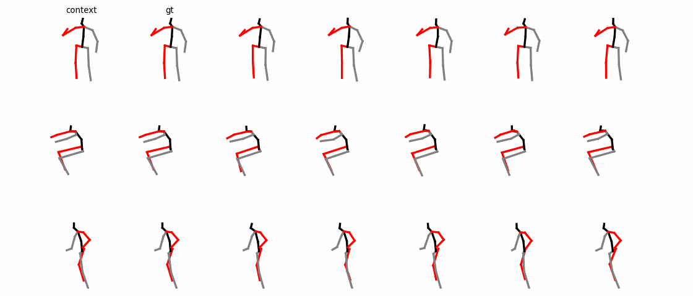
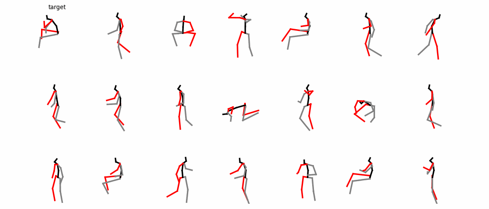
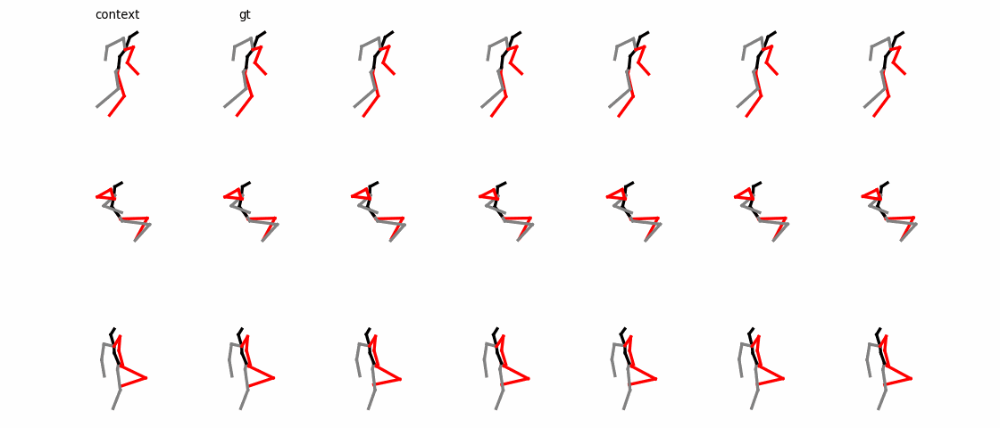

# ICCV 2023 HumanMAC

**为响应[开放共享科研记录行动倡议(DCOX)](https://mmcheng.net/docx/)，本工作将提供中文文档，为华人学者科研提供便利。**

"HumanMAC: 基于掩码图像补全的人体动作预测"开源代码。

[陈凌灏](https://lhchen.top/)\*<sup>1</sup>, 张嘉伟*<sup>2</sup>, [李晔文](https://scholar.google.com/citations?user=W5796yEAAAAJ)<sup>3</sup>, [庞义人](https://www.linkedin.com/in/yrpang/)<sup>2</sup>, [夏晓波](https://xiaoboxia.github.io/)<sup>4</sup>, [刘同亮](https://tongliang-liu.github.io/)<sup>4</sup>

<sup>1</sup>清华大学, <sup>2</sup>西安电子科技大学, <sup>3</sup>南洋理工大学, <sup>4</sup>悉尼大学

[[项目主页](https://lhchen.top/Human-MAC/)] | [[预印本](https://arxiv.org/abs/2302.03665)] | [[README-en](../README.md)] | [[视频](https://www.youtube.com/watch?v=vfde9GdUHBs)] | [[代码](https://github.com/LinghaoChan/HumanMAC)]

> 人体动作预测是计算机视觉和计算机图形学中的经典问题，具有广泛的实际应用。 之前的工作基于编码-解码的样式实现了较好的预测性能。 这些方法首先将先前的动作编码为潜在表示，然后将潜在表示解码为预测动作。 然而，在实践中，由于损失函数约束复杂、训练过程繁琐、预测中不同类别动作的切换稀少等问题，它们仍然不尽如人意。 在本文中，针对上述问题，我们跳出上述的建模范式，从新的角度提出了一个新颖的框架。 具体来说，我们的框架以去噪扩散模型的方式工作。 在训练阶段，我们学习了一个人体动作扩散模型，该模型从随机噪声中生成人体动作。 在推理阶段，通过去噪过程，我们对观察到的动作进行动作预测调节，以输出更连续和可控的预测。 我们提出的框架具有较大发展潜力，它只需要优化一个损失函数，并且以端到端的方式进行训练。 此外，它有效地完成了不同类别动作的切换，这在现实任务中具有重要意义，例如动画任务。 基准测试的综合实验证实了所提出框架的优越性。 项目主页： https://lhchen.top/Human-MAC 。

## 更新信息

**[2023/10/17]: 欢迎查看最新的开源项目[UniMoCap](https://github.com/LinghaoChan/UniMoCap)，统一基于动捕的文本-动作数据集工具。**

**[2023/07/14]: HumanMAC被ICCV 2023录用！**

**[2023/03/26]: HumanMAC代码开源！**

## 准备

### 数据准备

**对于[Human3.6M](http://vision.imar.ro/human3.6m/description.php)和[HumanEva-I](http://humaneva.is.tue.mpg.de/):**

我们继承了[GSPS](https://github.com/wei-mao-2019/gsps)的数据预处理框架和数据集。可以从[此处](https://drive.google.com/drive/folders/1sb1n9l0Na5EqtapDVShOJJ-v6o-GZrIJ)下载数据集文件，并把所有文件放在`./data`目录下。

**用于零样本预测实验的[AMASS](https://amass.is.tue.mpg.de/)数据集:**

我们将AMASS数据集骨骼重定向到Human3.6M数据集的骨架上。这里我们只提供AMASS动作的一个子集。重定向后的数据集在[Google Drive](https://drive.google.com/file/d/1ysXf0rpxNqx3FScIf5hkk7JIyM_54aLW/view) ([百度网盘](https://pan.baidu.com/s/1vljNdr7CwBgYlF2QX8S5EA?pwd=qnue))下载。并将.npy文件放在`./data`目录下。重定向过程的细节详见 [`./motion-retargeting`](./motion-retargeting).

最后的`./data`目录结构如下所示：

```
data
├── amass_retargeted.npy
├── data_3d_h36m.npz
├── data_3d_h36m_test.npz
├── data_3d_humaneva15.npz
├── data_3d_humaneva15_test.npz
├── data_multi_modal
│   ├── data_candi_t_his25_t_pred100_skiprate20.npz
│   └── t_his25_1_thre0.500_t_pred100_thre0.100_filtered_dlow.npz
└── humaneva_multi_modal
    ├── data_candi_t_his15_t_pred60_skiprate15.npz
    └── t_his15_1_thre0.500_t_pred60_thre0.010_index_filterd.npz
```

### 预训练模型

为了方便HumanMAC各种能力的演示，我们提供了在Human3.6M上的预训练模型[Google Drive](https://drive.google.com/file/d/1Jah4aIbrsSRTBqSxzT-MI55fD62PGxCT/view?usp=sharing) ([百度网盘](https://pan.baidu.com/s/1kX88ya6J7j-pG46Se12Xkg?pwd=haj8))。预训练模型需放在`./checkpoints`目录下。

### 环境配置

```
sh install.sh
```

## 训练

对于Human3.6M:

```
python main.py --cfg h36m --mode train
```

对于HumanEva-I:

```
python main.py --cfg humaneva --mode train
```

运行指令后，`./results`目录下会创建名为`<DATASET>_<INDEX>`的目录（`<DATASET>`属于`{'h36m', 'humaneva'}`， `<INDEX>`等于`./results`下的目录数量）。训练过程，`gif`s储存在`./<DATASET>_<INDEX>/out`中，日志文件存储在`./<DATASET>_<INDEX>/log`中，模型检查点储存在`./<DATASET>_<INDEX>/models`中，指标储存在`./<DATASET>_<INDEX>/results`中。

## 预测可视化



对于Human3.6M:

```
python main.py --cfg h36m --mode pred --vis_row 3 --vis_col 10 --ckpt ./checkpoints/h36m_ckpt.p
```

对于HumanEva-I:

```
python main.py --cfg humaneva --mode pred --vis_row 3 --vis_col 10 --ckpt ./checkpoints/humaneva_ckpt.pt
```

`vis_row`和 `vis_col` 分别代表绘制的`gif`s的行数和列数。数据集中的每一类动作都会有两张`gif`s，每一张`gif`包含`vis_row`个动作，每个动作有`vis_col`个候选预测。`gif`s储存在`./inference/<DATASET>_<INDEX>/out`。

## 动作切换



动作切换的演示：

```
python main.py --mode switch --ckpt ./checkpoints/h36m_ckpt.pt
```

`vis_switch_num`张`gif`s会储存在`./inference/switch_<INDEX>/out`中，每一张`gif`包含30个动作，这些动作最后会切换到其中的一个动作上。

## 可控动作预测


可控动作预测的演示：

```
python main.py --mode control --ckpt ./checkpoints/h36m_ckpt.pt
```

7张`gif`s会储存在`./inference/<CONTROL>_<INDEX>/out`中，每张`gif`有`vis_row`个动作，每个动作有`vis_col`个候选预测。`<CONTROL>`对应`{'right_leg', 'left_leg', 'torso', 'left_arm', 'right_arm', 'fix_lower', 'fix_upper'}`。

## AMASS数据集的零样本测试



在AMASS数据集上的零样本测试演示：

```
python main.py --mode zero_shot --ckpt ./checkpoints/h36m_ckpt.pt
```

零样本测试实验的`gif`s将储存在`./inference/zero_shot_<INDEX>/out`，其动作数量同样由`vis_col`和`vis_row`设置。

## 评估

对于Human3.6M:

```
python main.py --cfg h36m --mode eval --ckpt ./checkpoints/h36m_ckpt.pt
```

对于HumanEva-I:

```
python main.py --cfg humaneva --mode eval --ckpt ./checkpoints/humaneva_ckpt.pt
```

**注**：我们将评估指标（APD、ADE、FDE、MMADE、MMFDE）的计算过程并行化，以加快计算速度，因此这部分严格要求使用GPU。

## 致谢

感谢西安电子科技大学的周钰坤和南京大学的[杨文昊](http://www.lamda.nju.edu.cn/yangwh/)提供的宝贵建议和技术支持。

本文的部分代码借用自[DLow](https://github.com/Khrylx/DLow)和[GSPS](https://github.com/wei-mao-2019/gsps)。

## 开源许可证

本代码许可证为[MIT LICENSE](https://github.com/LinghaoChan/HumanMAC/blob/main/LICENSE). 注意！我们的代码依赖于一些拥有各自许可证的第三方库和数据集，你需要遵守对应的许可证协议。

## 引文

如果您觉得我们的工作对您的研究有帮助，请考虑引用我们的论文：

```
@inproceedings{chen2023humanmac,
	title={HumanMAC: Masked Motion Completion for Human Motion Prediction},
	author={Chen, Ling-Hao and Zhang, Jiawei and Li, Yewen and Pang, Yiren and Xia, Xiaobo and Liu, Tongliang},
	journal={Proceedings of the IEEE/CVF International Conference on Computer Vision (ICCV)},
	year={2023}
}
```

联系方式：thu DOT lhchen AT gmail DOT com
